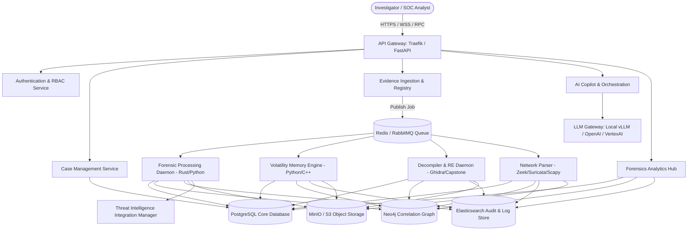

# 01. Product Architecture & Microservices Specification

This document details the high-level architecture and microservices design of the **Enterprise AI-Powered Digital Forensics & Incident Response Platform (AI-DFIR Suite)**. The platform is designed for horizontal scaling, strict multi-tenancy, and high availability, allowing the processing of multi-terabyte disk images, memory dumps, and heavy network traffic captures simultaneously.

---

## 🏛️ System Architecture Overview

The system utilizes a containerized microservices architecture coordinated via **Kubernetes** (or **Docker Compose** for local enterprise deployment). Fronted by an API Gateway, the services communicate asynchronously via a messaging bus (**RabbitMQ/Celery**) or synchronously using high-performance **gRPC** interfaces.

### Macro-Scale Architecture Diagram

---

## ⚙️ Core Microservices

### 1. Ingestion & Storage Service (`evid-ingest-service`)
* **Role:** Receives raw evidence packages (E01, AFF, RAW, VMDK, PCAPs, logs), calculates initial cryptographic hashes (SHA-256, MD5, SSDEEP), establishes the Chain of Custody record, and writes evidence blocks to object storage.
* **Tech Stack:** FastAPI, Rust-based streaming hashing libraries, MinIO Client SDK.
* **Storage Layer:** MinIO or AWS S3 buckets with WORM (Write Once Read Many) bucket policies enabled.

### 2. Forensic Processing Worker (`forensic-processor-worker`)
* **Role:** Orchestrates partition extraction, deleted file recovery (carving), MFT parsing, and artifact extraction (Prefetch, Shimcache, Event logs). 
* **Tech Stack:** Celery, Python, PyTSK (SleuthKit bindings), Rust-based custom parser extensions.

### 3. Memory Forensic Service (`memory-forensics-worker`)
* **Role:** Executes Volatility 3 and Rekall pipelines against raw memory images. Parses process lists, hooks, active network sockets, and DLLs.
* **Tech Stack:** Python, Volatility 3 framework wrapper, customized Cython extensions for kernel table parsers.

### 4. Reverse Engineering Daemon (`malware-re-worker`)
* **Role:** Manages binary decompilation, disassembling, strings parsing, and capability extraction. Runs YARA rules against extracted bin files.
* **Tech Stack:** Capstone Engine, Unicorn Emulator, Radare2, Ghidra headless runner, PEfile, LIEF.

### 5. Network Traffic Analyzer (`network-analysis-worker`)
* **Role:** Extracts flows, metadata, and alerts from PCAP and PCAPNG files. Generates conversation trees.
* **Tech Stack:** Zeek, Suricata, Scapy, C++ PCAP wrappers.

### 6. AI Agent Orchestrator (`ai-copilot-service`)
* **Role:** Interacts with the LLMs to run semantic searches, correlate timeline records, summarize artifacts, map findings to the MITRE ATT&CK matrix, and generate draft investigative reports.
* **Tech Stack:** FastAPI, LangChain, LangGraph, Qdrant/Chroma Vector Database, local vLLM server hosting Llama-3-70B-Instruct or OpenAI GPT-4o API.

---

## 🗄️ Database & Caching Topology

To handle the structural differences in forensic data, a **polyglot persistence** model is implemented:

| Database | Technology | Primary Role | Caching / Performance Optimization |
|---|---|---|---|
| **Relational DB** | PostgreSQL 16 | Cases, metadata, users, roles, notes, chain of custody logs, file references. | Connection pooling (PgBouncer), indexed B-Tree keys, custom partitioning by `case_id`. |
| **Document/Log DB**| Elasticsearch 8 | Indexed forensic timelines, processed event logs, parsed registry keys, extracted string outputs. | SSD storage tiering, shards mapped per investigation case, read-heavy query indexing. |
| **Graph DB** | Neo4j 5 | Entity correlation nodes (IPs, processes, hashes, files, domain names, emails). | Graph cache warmup, indexing key nodes like IP addresses, files, and users. |
| **Vector DB** | Qdrant | Embeddings of threat intelligence reports, extracted strings, disassembled code, and parsed documentation. | HNSW indexing, quantized embeddings, GPU-accelerated querying. |
| **Cache & Task Bus**| Redis Enterprise | Session tokens, real-time event distribution, Celery task states, intermediate calculation caching. | Cluster setup with active replication, memory limits with LRU eviction strategy. |

---

## 🌐 Deployment Scenarios

The platform supports three enterprise-ready deployment configurations:

### A. Cloud Deployment (AWS / Azure)
* Designed for large MSSPs and distributed enterprise incident response teams.
* **AWS Mapping:** ECS/EKS for services, AWS Aurora PostgreSQL (multi-AZ) for relational storage, Amazon OpenSearch for Elastic, AWS MSK for message bus, AWS S3 Object Storage with Object Lock enabled for legal compliance.
* **Security:** AWS KMS for envelope encryption, AWS WAF, IAM RBAC integration.

### B. On-Premises Air-Gapped Deployment
* Tailored for government agencies, military networks, and highly secure industrial sectors (SCADA/ICS).
* **Architecture:** Kubernetes (Rancher K3s) on local bare-metal servers. MinIO distributed storage on local NVMe arrays. Local LLM models running on GPU nodes (NVIDIA H100 or A100) using vLLM / Ollama.
* **Security:** Local hardware-security modules (HSMs) for vault keys, local Active Directory/LDAP integration.

### C. Hybrid Deployment
* Ingestion and parsing worker engines run locally (on-premises or inside a local branch network) to avoid transferring multi-terabyte disk images to the cloud. Analysis metadata and graphs are synchronized securely with the cloud-hosted master dashboard.

---

## ⚙️ DevOps, Monitoring, & Logging

* **CI/CD Pipeline:** GitHub Actions / GitLab CI building Docker images, validating syntax via Pytest & ESLint, running security vulnerability checks (Trivy), and publishing to a secure private container registry.
* **Monitoring & Observability:**
  * **Metrics:** Prometheus scrape targets for CPU/Memory utilization of workers, disk queue sizes, ingestion rates, and DB latency. Visualized using customized Grafana dashboards.
  * **Distributed Tracing:** OpenTelemetry collectors integrated across FastAPI and Celery workers to track API call latency and thread bottle-necks.
  * **Alerting:** Alertmanager hooks into Slack, Microsoft Teams, and PagerDuty for queue congestion, hard drive exhaustion, and service crashes.
* **Disaster Recovery (DR):**
  * **Backup Policy:** Hourly snapshot of PostgreSQL database, daily incremental backup of Elasticsearch indexes, active-active replication of object storage.
  * **RTO (Recovery Time Objective):** Under 2 hours for primary dashboard access.
  * **RPO (Recovery Point Objective):** Under 1 hour for case data metadata.
