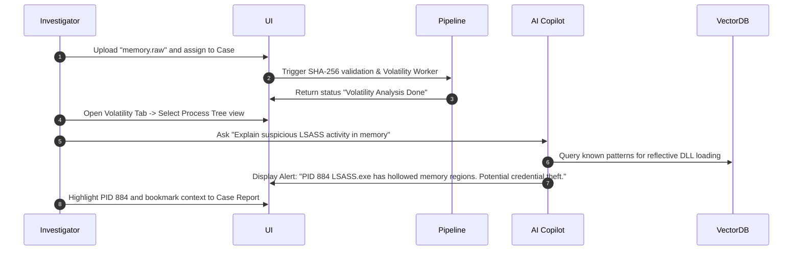
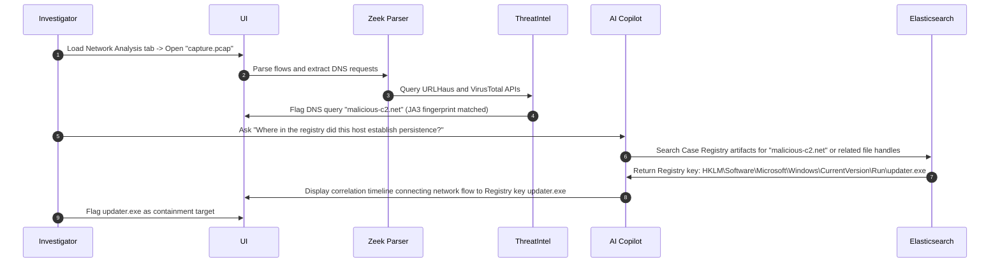

# 02. UI/UX Specifications & Layout System

This document specifies the Enterprise Design Language, Navigation Flows, Theme Settings, and Screen Layouts for the **AI-DFIR Platform**. It covers dark and light themes, typography guidelines, responsive behaviors, dockable multi-tab interfaces, and structural mockups for key workspace views.

---

## 🎨 System Theme & Color Tokens (HSL)

To prevent visual fatigue during long investigations, the interface utilizes high-contrast, deeply saturated slate, charcoal, and neon-highlight accents.

### Dark Mode (Core Palette)
* **Background (Canvas):** `hsl(222, 47%, 11%)` (Deep Slate Navy)
* **Card / Panel Background:** `hsl(223, 47%, 16%)` (Slate Grey)
* **Borders / Separators:** `hsl(217, 32%, 18%)` (Muted Slate)
* **Primary Text:** `hsl(210, 40%, 98%)` (Off-White)
* **Secondary Text:** `hsl(215, 20%, 65%)` (Muted Grey)
* **Accent Primary (Copilot/Intel):** `hsl(263, 70%, 50%)` (Indigo Violet)
* **Accent Warning (Suspicious):** `hsl(38, 92%, 50%)` (Amber Gold)
* **Accent Danger (Alerts/Threats):** `hsl(346, 84%, 50%)` (Crimson Rose)
* **Accent Safe (Verified/Clean):** `hsl(142, 72%, 29%)` (Emerald Green)

### Light Mode (Core Palette)
* **Background (Canvas):** `hsl(210, 40%, 98%)` (Soft White)
* **Card / Panel Background:** `hsl(0, 0%, 100%)` (Pure White)
* **Borders / Separators:** `hsl(214, 32%, 91%)` (Light Border Grey)
* **Primary Text:** `hsl(222, 47%, 11%)` (Deep Navy)
* **Secondary Text:** `hsl(215, 16%, 47%)` (Slate Grey)
* **Accent Primary:** `hsl(221, 83%, 53%)` (Blue Accents)
* **Accent Warning:** `hsl(35, 92%, 33%)` (Dark Gold)
* **Accent Danger:** `hsl(346, 84%, 40%)` (Crimson Red)

### Typography
* **Primary Font Face:** `Inter, -apple-system, sans-serif` (Optimal reading density).
* **Code / Hex / Disassembly Font:** `JetBrains Mono, SFMono-Regular, monospace` (For hex viewing, disassembly syntax, and file trees).

---

## 🧭 Navigation Flow & Workspace Hierarchy

The platform implements a multi-tab workspace structure. A global sidebar controls major workspace categories, while the primary viewport accommodates dockable panels, customizable tiles, and multi-tab cases.

```
[ Global Sidebar ]
   ├── Dashboard (Overview, active cases, stats feed)
   ├── Case Management (All cases table, SLAs, timelines)
   ├── Forensic Workspaces (Image Analysis, Memory, PCAP, Reverse Engineering)
   ├── Threat Intelligence (Feed lookup, correlation logs, STIX viewer)
   └── Platform Security (Audit trails, user access matrix, encryption vaults)
```

### Dockable Grid Workspace Layout
The Investigation Workspace uses a responsive grid based on **React Flow** and **React-Grid-Layout** that supports panel resizing, dragging, and splitting.

```
+--------------------------------------------------------------------------------------------------+
| CASE: APT29_DFIR_012 (Status: IN_PROGRESS) | Severity: CRITICAL | SLA: 01:24:12                  |
+-------------------+---------------------------------------------------------+--------------------+
| EVIDENCE ROOT     | VIEWPORT: TIMELINE VIEW                                 | AI COPILOT         |
| [-] Case Folder   | [ ] Filters: [Processes X] [Network X]                  |                    |
|   ├── disk.e01    | +-----------------------------------------------------+ | Ask anything:      |
|   ├── memory.raw  | | 12:04:12 | LSASS.EXE spawned by GPUPDATE.EXE        | | [What process    |
|   └── capture.pcap| | 12:04:30 | Network connection outbound: 185.220.101.4| |  spawned lsass?] |
|                   | | 12:04:45 | File writing: C:\Windows\Temp\dump.dmp   | |                    |
|                   | +-----------------------------------------------------+ | [🤖 Response]     |
|                   | VIEWPORT: PROCESS TREE RELATIONSHIPS                  | | The lsass dump   |
|                   | (GPUPDATE.EXE) ---> [LSASS.EXE (PID: 884)]            | | was triggered    |
|                   |                        |                                | | by GPUPDATE      |
|                   |                        +---> (dump.dmp)                 | | which indicates  |
|                   |                                                         | | DLL sideloading  |
|                   |                                                         | | anomaly.         |
+-------------------+---------------------------------------------------------+--------------------+
| STATUS: Ingesting evidence pipeline at 45.2 MB/s | Workers: 8 Active | YARA Matches: 3           |
+--------------------------------------------------------------------------------------------------+
```

---

## 📑 Core Screen Blueprints & Layout Logic

### 1. Executive Incident Dashboard
* **Purpose:** High-level summary for SOC Managers and Incident Directors.
* **Layout Design:** 4 KPI blocks across the top (Active Cases, Critical Incidents, Processing Queue, Mean Time to Containment). The middle block shows a split: (Left) **Threat Intelligence Feed** (World Map with GeoIP indicators of incident sources), (Right) **MITRE ATT&CK Heatmap** representing aggregate tactics discovered.

### 2. Multi-Tab Forensics Workspace
* **Purpose:** Main workstation for deep analysis.
* **Features:**
  * Tab 1: **Evidence Inventory:** List of hashes, signatures, file system offsets.
  * Tab 2: **Interactive Chronology:** Time-slider component permitting zooming into millisecond logs.
  * Tab 3: **Volatility Engine Map:** Interactive tree showing process lineage.
  * Tab 4: **Reverse Engineering Assembly Panel:** Interlocking views displaying Ghidra-style decompiled code on the left and x86 Assembly on the right.

### 3. AI Copilot Integration Panel
* **Purpose:** Side-docked chatbot that responds contextually to currently highlighted events.
* **Layout Design:** Sticky chat overlay displaying current confidence score and suggestions list. A single-click button "Generate Report Draft" compiles timeline items into a formatted template.

---

## 🛣️ User Journey Workflows

### Journey 1: Identifying LSASS Credentials Harvesting in Memory Dumps


### Journey 2: Correlating C2 Traffic to Registry Persistence

