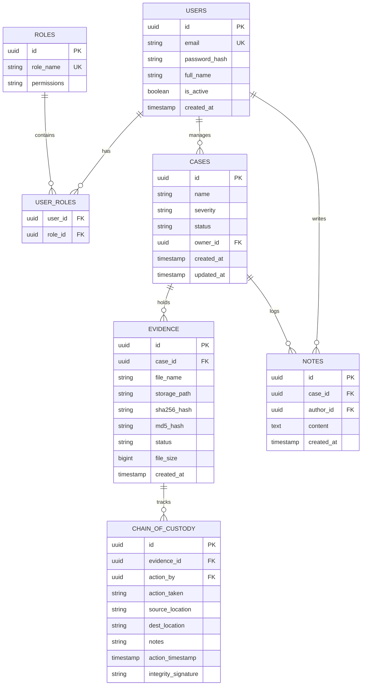
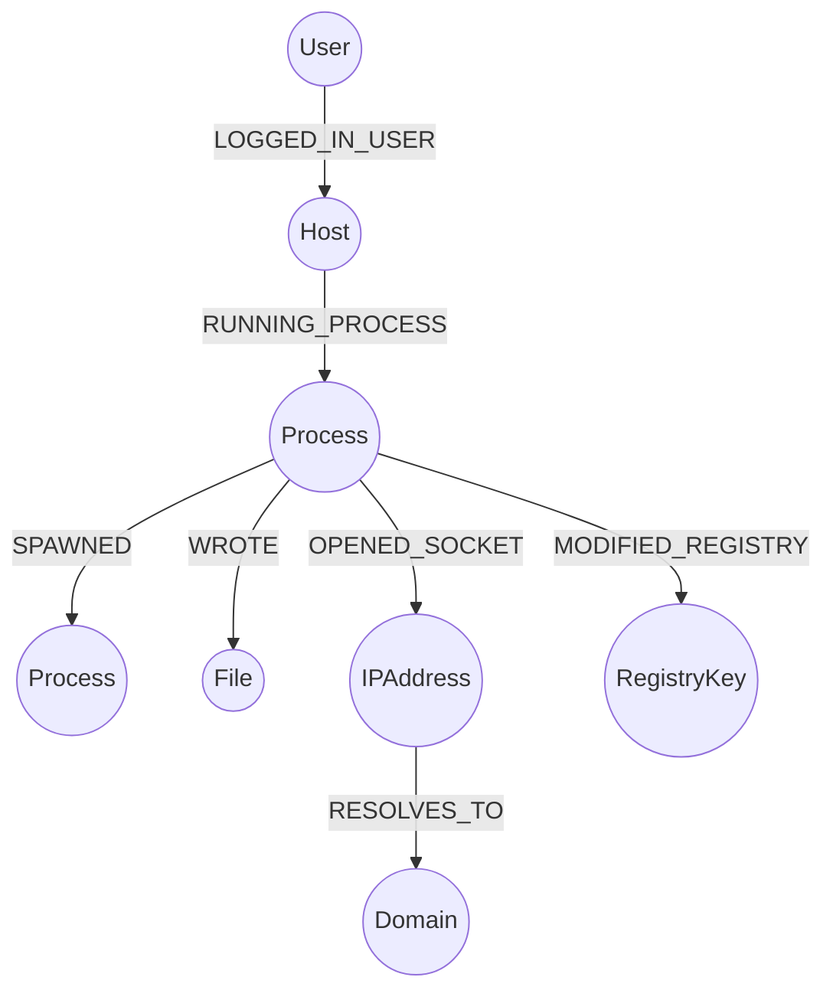

# 04. Database Schema Specifications

This document outlines the design and schema definitions for the multi-database persistence layers used in the **AI-DFIR Platform**. It specifies PostgreSQL tables, Neo4j Graph relations, and Qdrant Vector collections.

---

## 🏛️ Relational Entity-Relationship Model (PostgreSQL)

The relational engine stores structured tables, system authentication configurations, case tracking metrics, and evidence chains of custody.

---

## 🕸️ Graph Database Schema (Neo4j)

The graph database processes security event relationships. Nodes correspond to entities, and edges represent activities.

### Nodes (Labels & Properties)
* **`Host`**: `id` (Hostname/UUID), `ip_address`, `os_type`, `domain`.
* **`Process`**: `id` (PID + host), `pid`, `name`, `path`, `command_line`, `sha256`.
* **`File`**: `path`, `name`, `sha256`, `md5`, `size`, `entropy`.
* **`IPAddress`**: `ip`, `country`, `asn`, `reputation_score`.
* **`Domain`**: `domain_name`, `registrar`, `creation_date`.
* **`RegistryKey`**: `key_path`, `value_name`, `value_data`.
* **`User`**: `username`, `domain`, `privileges`.

### Relationships (Edges)
* `(Process)-[:SPAWNED]->(Process)`
* `(Process)-[:WROTE]->(File)`
* `(Process)-[:READ]->(File)`
* `(Process)-[:OPENED_SOCKET]->(IPAddress)`
* `(Process)-[:MODIFIED_REGISTRY]->(RegistryKey)`
* `(Host)-[:LOGGED_IN_USER]->(User)`
* `(File)-[:RESOLVES_TO]->(Domain)`

---

## 🧠 Vector Database Schema (Qdrant / Chroma)

The vector search database stores high-dimensional embeddings of text, decompiled code instructions, event descriptions, and intelligence feeds.

### Collection 1: `forensic_timelines`
* **Vector Configuration:** 1536 Dimensions (for standard `text-embedding-3-small` / OpenAI compatibility) or 1024 Dimensions (`bge-large-en-v1.5` for local embeddings).
* **Distance Metric:** Cosine Similarity.
* **Payload Fields:**
  * `case_id`: UUID
  * `timestamp`: Unix timestamp
  * `event_type`: "process" | "network" | "registry" | "file"
  * `raw_log`: String of original event output
  * `summary`: String explanation generated during indexing

### Collection 2: `reverse_engineering_symbols`
* **Vector Configuration:** 768 Dimensions (using models like `codebert-base` or `graphcodebert`).
* **Distance Metric:** Cosine / Inner Product.
* **Payload Fields:**
  * `file_sha256`: String
  * `function_name`: String
  * `assembly_code`: Text string
  * `decompiled_pseudocode`: Text string
  * `predicted_capability`: Array of strings (e.g. `["crypto", "socket"]`)

### Collection 3: `threat_intelligence_reports`
* **Vector Configuration:** 1536 Dimensions (or equivalent).
* **Distance Metric:** Cosine.
* **Payload Fields:**
  * `threat_actor`: String (e.g., "APT29")
  * `indicators`: Array of strings
  * `mitre_techniques`: Array of strings
  * `source_url`: String
  * `parsed_document`: Markdown text snippet
