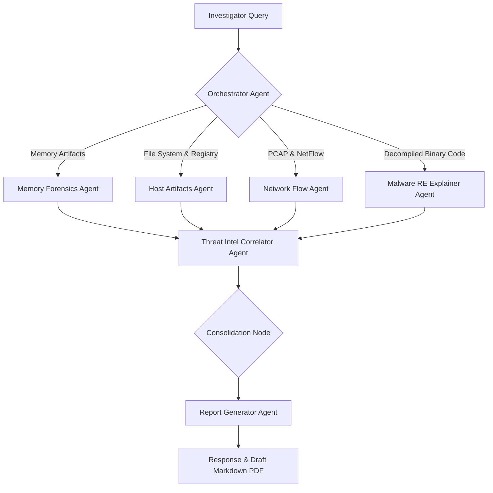

# 06. AI Agent Architecture & Orchestration Workflows

This document specifies the multi-agent orchestrator system, Retrieval-Augmented Generation (RAG) architecture, and threat scoring algorithms that enable autonomous and natural language investigations within the **AI-DFIR Platform**.

---

## 🤖 Multi-Agent Framework (LangGraph Router)

The AI capability is driven by specialized agent personas that collaborate to triage anomalies. The **Orchestrator Agent** acts as a state router, distributing tasks to sub-agents depending on the context of the investigator's query.



### Specialized Sub-Agent Profiles
1. **Orchestrator Agent:** Interprets natural language questions, extracts intents and target entities (e.g. Hostnames, IP, Process Name), routes execution steps, and acts as the gatekeeper for local tool execution hooks.
2. **Memory Forensics Agent:** Evaluates raw process maps, page permissions, and Volatility plugin outputs. Specializes in finding reflective DLL loaders, LSASS dumps, and API hook offsets.
3. **Host Artifact Agent:** Parses NTFS trees, MFT details, Prefetch runs, registry auto-runs, and event log chains to locate lateral movement footprints.
4. **Network Flow Agent:** Detects anomalous ports, session runtimes, beaconing behaviors, DNS tunneling patterns, and JA3 cipher anomalies.
5. **Malware RE Explainer Agent:** Interacts with Capstone/Ghidra headless APIs to review assembly loops, decode strings (XOR decoding), and map capability profiles.
6. **Threat Intel Correlator Agent:** Cross-references indicators (hashes, IPs, names) against MISP threat groups and CISA Known Exploited Vulnerabilities databases.
7. **Report Generator Agent:** Synthesizes analysis data into standardized markdown reports matching compliance frameworks.

---

## 🔍 Retrieval-Augmented Generation (RAG) Architecture

To feed high-volume forensic logs to LLMs without exceeding token boundaries, a chunked vector-index RAG system is used:

```
+------------------+     +-------------------+     +------------------+
| Raw Forensic Log | --> | Chronology Chunk  | --> | Embedding Model  | --+
| (Registry/Events)|     | (5-min windows)   |     | (bge-large-en)   |   |
+------------------+     +-------------------+     +------------------+   |
                                                                          v
+------------------+     +-------------------+     +------------------+ +---------------+
| Investigator     | --> | Retrieve Matches  | <-- | Search Vector DB | | Qdrant Vector |
| Natural Prompt   |     | (Top k chunks)    |     | (Cosine Match)   | | Collections   |
+------------------+     +-------------------+     +------------------+ +---------------+
         |
         v
+------------------+
| Prompt Synthesis | --> [ LLM Generation ]
+------------------+
```

### Data Chunking Rules:
* **Timeline Events:** Chunked into sliding windows of 5 minutes containing sequential execution traces to maintain operational context.
* **Decompiled Code:** Chunked by function blocks rather than arbitrary line divisions.

---

## 🧮 Forensic Risk & Confidence Scoring Model

To assist triage, the AI scores events based on severity and confidence.

### 1. Risk Score Formula
The platform computes a **Global Risk Score ($R_S$)** for every correlated attack path node using:

$$R_S = \min\left(100, \sum (T_{wt} \times S_c) + I_{score} + M_{score}\right)$$

Where:
* **$T_{wt}$**: Weight of the MITRE ATT&CK technique (e.g., Initial Access = 10, Credential Access = 35, Exfiltration = 45).
* **$S_c$**: Severity of the alert (Low: 1.0, Medium: 1.5, High: 2.5, Critical: 4.0).
* **$I_{score}$**: Threat Intelligence match weight (IP/Domain match on MISP = 30; VirusTotal detection count > 10 = 40).
* **$M_{score}$**: Memory anomaly weight (Volatility injected code detection = 50).

### 2. Confidence Score Model
The **Confidence Score ($C_S$)** represents the mathematical likelihood that the detection is an actual compromise rather than a false positive:

$$C_S = \frac{\sum (W_i \times V_i)}{\sum W_i}$$

* **$V_i$**: Verification inputs (e.g., Binary signed? $V_1 = 0$; Binary unsigned in system folder? $V_2 = 1$; Command-line parameters match known LOLBins obfuscation? $V_3 = 1$).
* **$W_i$**: Weight assigned to the verification source (e.g., Kernel-level logging weight = 1.0, Static file path anomaly weight = 0.5).
