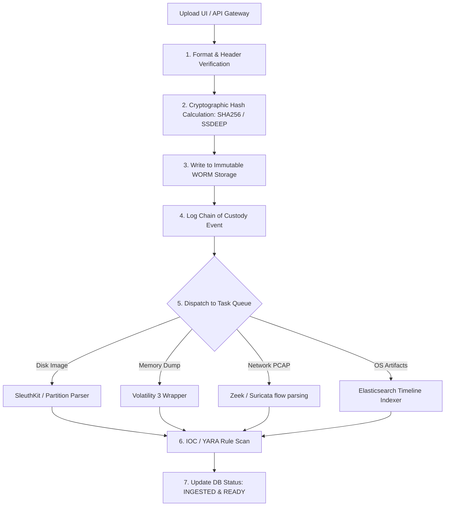

# 07. Evidence Ingestion & Processing Pipeline

This document specifies the data pipeline and processing architecture used to ingest physical disk images, memory captures, packet logs, and telemetry into the **AI-DFIR Platform** while guaranteeing evidentiary integrity and a legally-defensible chain of custody.

---

## 🛠️ Step-by-Step Ingestion Pipeline Workflow

Evidence files pass through an asynchronous pipeline that balances heavy compute tasks (decompression, indexing, deep parsing) with high-speed write loops.

### Ingestion Stages Description
1. **Validation:** Checks magic numbers of uploaded files to ensure the headers match declared formats (e.g. `EVF1` for E01 files, or standard PCAP headers).
2. **Hash Calculation:** Generates cryptographic checksums using an optimized Rust streaming library. It generates:
   * **SHA-256:** Primary file identification.
   * **MD5:** Backwards compatibility for historical threat feeds.
   * **SSDEEP:** Fuzzy hash for locating variant malware binaries.
3. **Write to Object Storage:** Streams the file into a MinIO bucket configured with a strict Object Lock policy.
4. **Log Chain of Custody:** Creates an entry in the PostgreSQL database signing the event with the investigator's certificate.
5. **Dispatch Queue:** Publishes an execution job to RabbitMQ. Celery picks up the job and distributes it to a specialized node.
6. **YARA & Threat Scan:** Extracted binaries and text sections are scanned for threat signatures.
7. **Finalization:** Marks the evidence as ready for query, issuing a WebSocket event to the UI dashboard.

---

## 🔒 Immutable Evidence Architecture

To ensure evidence remains admissible in court, the system enforces a zero-trust storage layer.

### 1. Object Lock WORM (Write Once Read Many) Configuration
* **MinIO Bucket Policy:** Enforces **Compliance Mode** with a default retention period (e.g., 7 years). In Compliance Mode, the retention settings cannot be changed, and files cannot be deleted or overwritten by any user, including the root administrator.
* **Storage Encryption:** Files are encrypted at rest using envelope encryption via AES-256-GCM. The key is managed by an external Key Management System (HashiCorp Vault or AWS KMS).

### 2. Digital Signatures (ECDSA Verification)
Every evidence upload generates a signature block to guarantee identity and verification integrity.

* **Private Key:** Each investigator is assigned a unique cryptographic key stored in an HSM or encrypted local store.
* **Signing Algorithm:** SHA-256 of the payload is signed using **ECDSA (secp256k1)**.
* **Signature Verification Check:**
  $$\text{Verified} = \text{ECDSA\_Verify}(\text{Hash}_{\text{SHA256}}(\text{Evidence File}), \text{Signature}, \text{Investigator PublicKey})$$
* **Scheduled Verification Daemon:** A background cron task re-hashes all stored assets monthly, verifying them against the registered signature block to detect bit rot or filesystem manipulation.

### 3. Log Chain of Custody (CoC) Structure
The database enforces that CoC logs are append-only. Any attempt to update or delete a row triggers a PostgreSQL database rule that halts the transaction and raises a high-severity SOC alert.

* **Audit Entry Fields:**
  * Timestamp
  * Evidence UUID
  * Operating User ID
  * Event Type (Ingest, View, Extract, Archive, Delete-Attempt)
  * Location Coordinates (IP, MAC Address, Host Workspace)
  * Integrity Hash (SHA-256 of the previous ledger row, creating a cryptographic hash chain similar to a private ledger).
