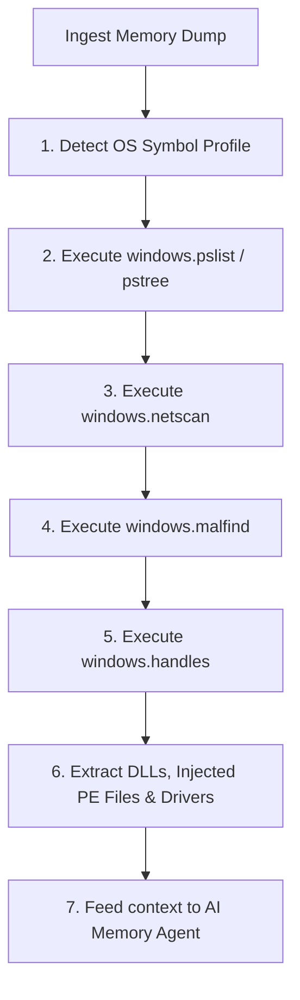
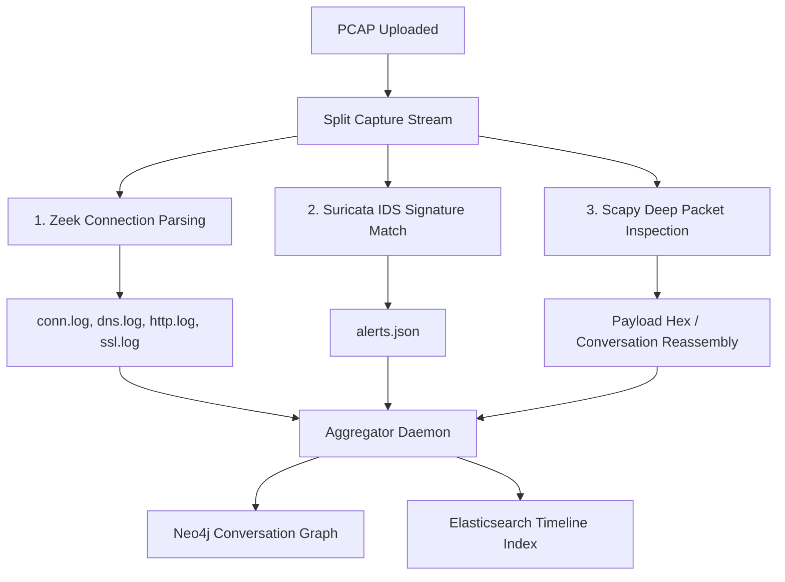

# 08. Forensic Engine Workflows

This document specifies the execution pipelines, plugin sequences, commands, and script arguments utilized by the underlying forensic engines in the **AI-DFIR Platform**.

---

## 🧠 1. Volatility 3 Memory Forensics Pipeline

When a memory dump is registered, the Celery worker triggers a structured analysis pipeline.



### Volatility CLI Wrapper Command Examples
The worker runs Volatility 3 via python subprocess hooks, redirecting JSON outputs:
```bash
# 1. Output process trees to JSON
python vol.py -f /evidence/mem.raw -r json windows.pstree.PsTree > /tmp/pstree.json

# 2. Find injected memory sections
python vol.py -f /evidence/mem.raw -r json windows.malfind.Malfind > /tmp/malfind.json

# 3. Dump suspicious process memory for YARA scanning (e.g. PID 884)
python vol.py -f /evidence/mem.raw windows.pefind.PEfind --pid 884 --dump > /evidence/extracted_bins/
```

---

## 🔍 2. Headless Ghidra & Capstone Disassembly Pipeline

Used to analyze suspicious binaries carved from disk or dumped from memory.

```
+--------------------+     +-------------------+     +------------------+
| Suspicious PE/ELF  | --> | Headless Ghidra   | --> | Export Flat AST  | --+
| Binary File        |     | Analysis Script   |     | JSON & CallGraph |   |
+--------------------+     +-------------------+     +------------------+   |
                                                                            v
+--------------------+     +-------------------+     +------------------+ +---------------+
| AI Malware Agent   | <-- | Match Capa Rules  | <-- | Run Capstone to  | | Extract PE    |
| Purpose Summary    |     | (Identify Caps)   |     | disassemble code | | Headers/Import|
+--------------------+     +-------------------+     +------------------+ +---------------+
```

### Ghidra Headless Execution Wrapper
```bash
/opt/ghidra/support/analyzeHeadless \
  /tmp/ghidra_project_dir \
  MalwareProject \
  -import /evidence/extracted_bins/suspicious.exe \
  -postScript /opt/platform/scripts/GhidraDecompilerExport.java \
  -deleteProject
```
* **Post-Script Actions:** Extracts functions list, builds Control Flow Graph (CFG) representations in GraphML format, and outputs decompiled pseudo-code files.

---

## 🔌 3. Network Analysis (Zeek + Suricata + Scapy) Workflow

For PCAP evidence, the engine runs parallel extraction workers.



### Zeek Processing Wrapper Command
```bash
zeek -r /evidence/traffic.pcap -e "redef Log::default_writer = Log::WRITER_SQLITE;" local
# Parses metadata into structured relational records for fast querying.
```

---

## 💾 4. Host Registry Analysis Workflow

Registry hives are extracted from disk images (E01/DD) and parsed out of path locations:
* `C:\Windows\System32\config\SYSTEM`
* `C:\Windows\System32\config\SOFTWARE`
* `C:\Users\<User>\NTUSER.DAT`

### Processing Sequence
1. **RegRipper Wrapper Execution:**
   ```bash
   rip.pl -r /evidence/hives/NTUSER.DAT -p userassist > /tmp/userassist.txt
   rip.pl -r /evidence/hives/SYSTEM -p services > /tmp/services.txt
   ```
2. **Metadata Extraction:** Extracts execution counts, registry run keys, MRU (Most Recently Used) files, and USB mount histories.
3. **Database Insertion:** Parses the RegRipper outputs into JSON format, loading them directly into the Elasticsearch document index for search access.
