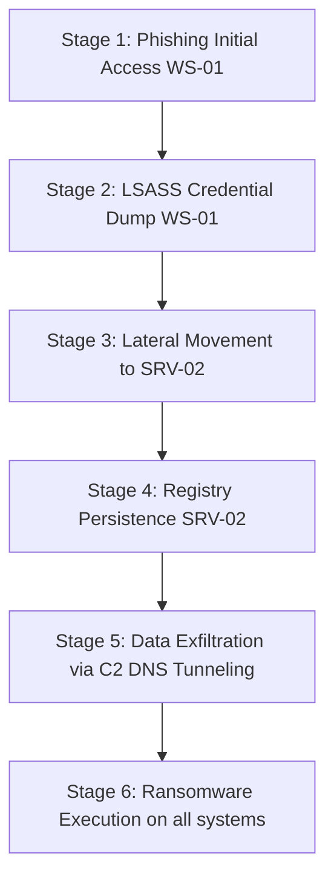

# 10. End-to-End Investigation Scenario

This document presents a step-by-step case scenario demonstrating how the **AI-DFIR Platform** processes a multi-stage enterprise intrusion involving phishing, credential harvesting, lateral movement, data exfiltration, and ransomware execution.

---

## 🎭 Incident Narrative: "Project Chimera"

### Host Info
* **Target Environment:** Enterprise Active Directory domain `CHIMERA.LOCAL`.
* **Primary Systems:**
  * `CHIMERA-WS-01`: Human Resources workstation (Windows 11).
  * `CHIMERA-SRV-02`: Production Application server running critical IIS services (Windows Server 2022).
  * `CHIMERA-DC-01`: Domain Controller (Windows Server 2022).

---

## 📈 Attack Stages & Timeline

### Stage 1: Initial Access & Phishing Execution
* **Time:** 2026-06-30T09:12:00Z
* **Action:** HR analyst opens an email attachment `Resume_Review.zip` containing a shortcut link file (`Resume_Review.lnk`) pointing to a hidden folder executing a sideloaded DLL via a PowerShell utility.
* **Platform Detection:**
  * **Ingest Image Worker:** Extracts filesystem artifacts from the workstation disk image. Parses the `Resume_Review.lnk` file, identifying it points to a script target `powershell.exe -w hidden -enc...`
  * **AI Analysis:** Flags this command line as high entropy execution of a known Living-off-the-Land Binary (LOLBin).

### Stage 2: Memory Execution & LSASS Dumping
* **Time:** 2026-06-30T09:30:00Z
* **Action:** The malware spawns a subprocess designed to dump the LSASS memory space (`SAM/LSASS`) using DLL sideloading in a trusted system helper process (`gpupdate.exe`).
* **Platform Detection:**
  * **Memory Forensic Engine (Volatility 3):** Runs `windows.malfind` and `windows.pstree` on the workstation memory dump. It flags that `gpupdate.exe` (PID: 3320) spawned `lsass.exe` (PID: 884) which is an invalid parent-child process relationship (normally LSASS is spawned only by SMSS).
  * **AI Memory Copilot:** Flags the hollowed memory permissions (`PAGE_EXECUTE_READWRITE`) in PID 884 as indicative of Reflective DLL Loading and LSASS credential abuse.

### Stage 3: Lateral Movement & Pivot
* **Time:** 2026-06-30T10:15:00Z
* **Action:** Using compromised Domain Admin credentials extracted from memory, the actor initiates an RDP session from `CHIMERA-WS-01` to `CHIMERA-SRV-02`.
* **Platform Detection:**
  * **Event Log Parser:** Extracts Windows Security Logs (`Security.evtx`). Maps event ID `4624` (Successful Logon) on `CHIMERA-SRV-02` with **Logon Type 10** (RDP) originating from IP `192.168.42.10` (`CHIMERA-WS-01`).
  * **Graph database (Neo4j):** Links `WS-01` node and `SRV-02` node with a `[:CONNECTED_VIA_RDP]` edge.

### Stage 4: Registry Persistence Setup
* **Time:** 2026-06-30T11:00:00Z
* **Action:** Actor establishes persistence on the application server by writing a value in the local machine run keys pointing to a backdoor binary `updater.exe`.
* **Platform Detection:**
  * **Registry Parser:** Flags modification of `HKLM\SOFTWARE\Microsoft\Windows\CurrentVersion\Run` with value key name `SystemUpdate` directing to `C:\Windows\Temp\updater.exe`.

### Stage 5: DNS Tunneling Data Exfiltration
* **Time:** 2026-06-30T11:30:00Z
* **Action:** Backdoor collects proprietary configuration databases and streams them to external C2 namespaces (`exfil-dns-tunnel.net`) by encoding payloads into subdomain queries.
* **Platform Detection:**
  * **Network traffic analyzer (Zeek):** Parses the PCAP capture. Flags a massive volume of DNS requests querying subdomains of `exfil-dns-tunnel.net` (e.g. `base64data.exfil-dns-tunnel.net`). Calculates query frequency domains, identifying C2 beaconing behavior.
  * **Threat Intel Hub:** Automatically checks `exfil-dns-tunnel.net` against Shodan, GreyNoise, and VirusTotal APIs, raising a Threat Level Score of 95/100.

### Stage 6: Ransomware Execution
* **Time:** 2026-06-30T12:00:00Z
* **Action:** Actor executes file encryption across the network, dropping ransomware notes `HELP_DECRYPT.txt`.
* **Platform Detection:**
  * **Image Analyser:** Registers high-entropy write events, multiple file modifications (`.locked` extensions), and the creation of note files in all directory tables.

---

## 🤖 AI Summary Output Demo

During triage, the analyst clicks "Summarize Attack". The AI agent generates this synthesis:

### 🛡️ Threat Profile
* **Attacker Group:** APT29 / Cozy Bear (Matched via C2 domain reputation and code-sideloading signatures).
* **Confidence Rating:** 92%
* **Risk Score:** 98/100

### 📝 Executive Incident Summary
An analyst workstation was compromised via phishing at 09:12 UTC. The intruder dumped LSASS credentials to execute lateral movement via RDP to `CHIMERA-SRV-02` at 10:15 UTC. The adversary established persistence in registry run keys, exfiltrated database files via DNS Tunneling, and initiated ransomware encryption at 12:00 UTC.

### 🧩 IOC Synthesis
* **Malicious File:** `C:\Windows\Temp\updater.exe` (SHA-256: `a93b4f...`)
* **C2 Domain:** `exfil-dns-tunnel.net`
* **Exfiltration Host:** `192.168.42.20` (`CHIMERA-SRV-02`)

### ⚡ Recommended Containment Actions
1. **Host Isolation:** Trigger host containment policies on `CHIMERA-WS-01` and `CHIMERA-SRV-02` to isolate them from the network.
2. **Account Reset:** Revoke Domain Admin passwords and invalidate AD Kerberos ticketing sessions (double-reset krbtgt).
3. **C2 Block:** Add DNS sinkhole routing rule for `exfil-dns-tunnel.net` on internal firewalls.
